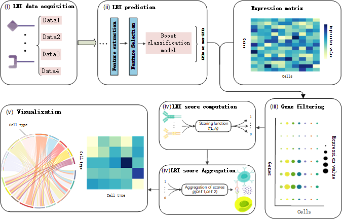

## Overview
<div style="text-align: center;">
  
</div>

## Data
Data is available at [uniprot](https://www.uniprot.org/), [GEO](https://www.ncbi.nlm.nih.gov/geo/).

## Environment
Install python3 for running this code. And these packages should be satisfied:
* tensorflow == 2.5.0
* keras == 2.7.0
* pandas == 1.1.4
* numpy == 1.19.5
* scikit-learn == 1.0.1
* matplotlib == 0.1.5
* xgboost == 1.6.2
* lightgbm == 3.3.0

## Feature Acquisition
[iFeature](https://github.com/Superzchen/iFeature)

## CCC analysis tools
[cellphonedb](https://github.com/Teichlab/cellphonedb),
[NATMI](https://github.com/asrhou/NATMI)

## Usage
first step, To run the model, default 5 fold cross validation，obtain LRI pair.
```
python code/CellConNet.py
```
the second step, The data format for processing cancer types is /example/xxx.csv .

the third step, Run three calculation methods[(cell expression)(expression product)(expression thresholding)].
```
python example/The cell expression calculation method code.py
python example/The expression product calculation method code.py
python example/The expression thresholding calculation method code.py
```
the final step, the three point estimation method is used to combine the results of three methods, the three point estimation method are detailed in the paper.