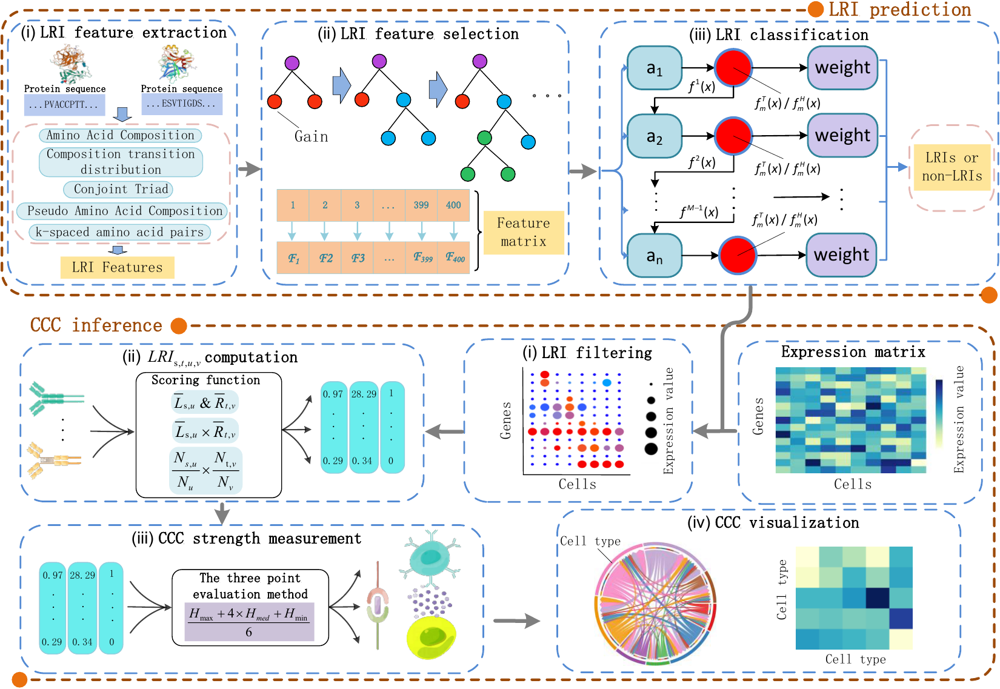

## Overview
<div style="text-align: center;">
  
</div>

## Data
Data is available at [uniprot](https://www.uniprot.org/), [GEO](https://www.ncbi.nlm.nih.gov/geo/).

## Package Environment
Install Python 3.9.15 for running this code. And these packages should be satisfied:
* seaborn == 0.12.0
* pandas == 1.5.3
* numpy == 1.19.5
* scikit-learn == 1.0.1
* matplotlib == 0.1.5
* xgboost == 1.6.2
* lightgbm == 3.3.0
* KTBoost == 0.2.2
* gpboost == 0.7.10


## Feature Acquisition
[iFeature](https://github.com/Superzchen/iFeature)


## Cell-cell communication tools for comparative analysis
[CellPhoneDB](https://github.com/Teichlab/cellphonedb),
[NATMI](https://github.com/asrhou/NATMI),
[iTALK](https://github.com/Coolgenome/iTALK),
[CellChat](https://github.com/sqjin/CellChat),
[CellComNet](https://github.com/plhhnu/CellComNet),
[CellEnBoost](https://github.com/plhhnu/CellEnBoost)


## Basic Tutorial
See a [Basic tutorial](https://github.com/Xwhut/CellDialog/blob/main/Basic_Tutorial.ipynb) how to Use a Cell-Cell Communication Analysis Computing Framework Based on Ligand Receptor and Single Cell RNA Sequencing Data (CellDialog).
The tutorial with the test data takes minutes to complete!  
The following is also a brief introduction to Usage.

## Usage
* scRNA-seq data: Each column is a normalised gene/protein expression profile of a cell type or an individual cell. An example snapshot of the abundance matrix is shown below. And the scRNA-seq data was processed by  code/Processing_scRNA-seq_data.py

||cell_type_0|cell_type_1|cell_type_2|...|
|-:|:-:|:-:|:-:|:-|
|**Gene1**|1.56|2.84|53|...|
|**Gene2**|13|3.2|42.4|...|
|**Gene3**|0.245|0|0.66|...|
|...|...|...|...|...|

1. First, run the model, the default 5 fold cross-validation, get LRI pairs. Or the user can user-specified LRI database directly, skip this step to the second step.
```

python code/CellDialog.py

```
2. The second step, Run **the three-point estimation method**, including [(cell expression)(expression product)(expression thresholding)]. (Note: the user-specified database only needs to replace the **LRI.csv** file and the corresponding format in the file.)
- Ligand-Receptor Interactions ：The interaction data should be represented as a two-column table, with the **first column** containing **ligands** and the **second column** containing **receptors** (as in the following example). 

|Ligand|Receptor|
|-:|:-|
|LIGAND1|RECEPTOR1|
|LIGAND2|RECEPTOR2|
|LIGAND3|RECEPTOR2|
|LIGAND4|RECEPTOR3|
|LIGAND4|RECEPTOR4|
|...|...|...|

```

python example/The_three-point_estimation_method.py

```
3. Finally, output the strength of cell-cell communication.

## Hardware Environment
This code was run on a computer with the following specifications:
* CPU: AMD EPYC 7302
* Memory: 256GB DDR4
* GPU: GeForce RTX 2080 Ti

However, the minimal requirements for running this protocol are:
* CPU: Intel Core i7-11800H
* Memory: 16GB DDR4
* GPU: NVIDIA GeForce RTX 3050Ti
* Storage: At least 10GB available

## CCC tool computational time and memory analysis.


||CellDialog|CellPhoneDB|NATMI|iTALK|CellChat|CellComNet|CellEnBoost|
|-:|:-:|:-:|:-:|:-:|:-:|:-:|:-|
|Time (S)|194.72|85.56|35.22|10.31|183.04|1366.07|4104.3|
|Memory (MB)|164.89|387.64|102.7|724.42|1186.59|166.65|186.82|

